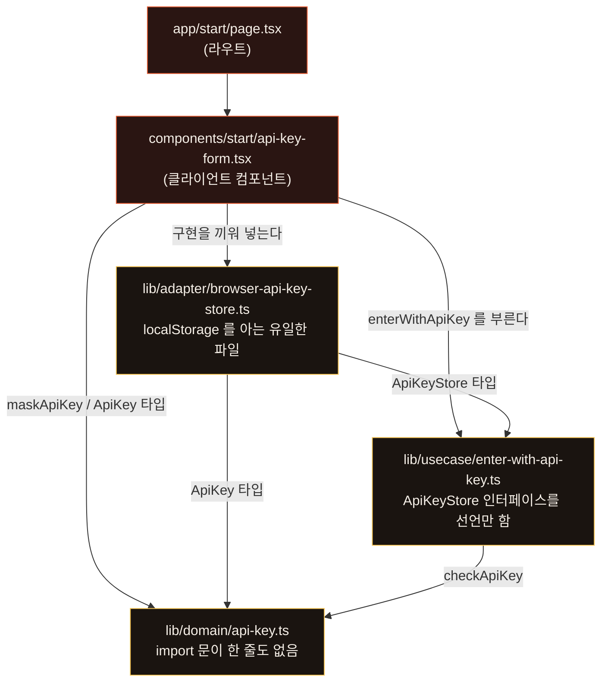
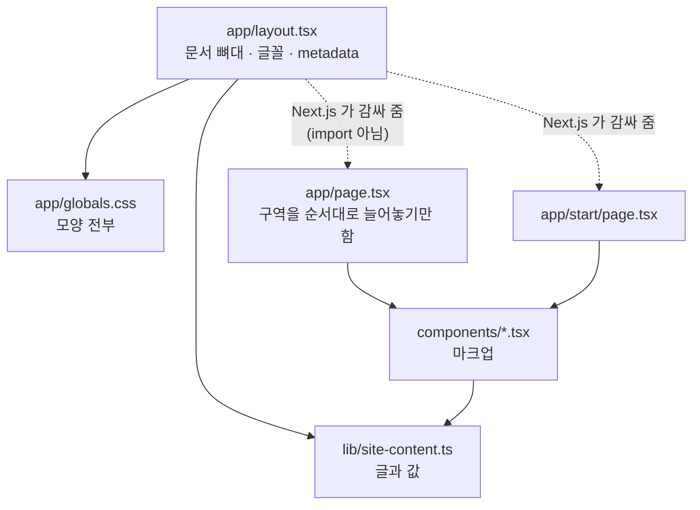
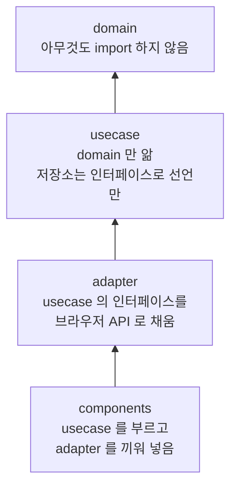
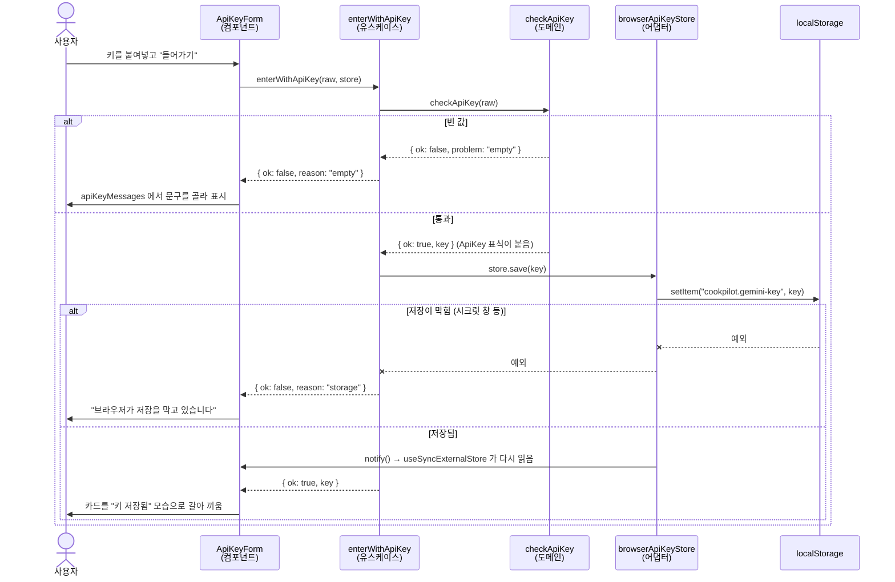

# 아키텍처 안내

이 문서는 지금 저장소에 **실제로 들어 있는** 파일과 그 역할을 적은 것입니다.
앞으로 지켜야 할 규칙은 `AGENTS.md`, 무엇이 언제 바뀌었는지는 `CHANGELOG.md`,
처음 실행하는 법은 `README.md` 에 있습니다.

작성 기준: 2026-08-21 (행별 주석 작업 이후). 줄 수는 주석을 포함한 값입니다.

---

## 1. 한 줄 요약

**서버에서 미리 그려 내보내는 정적 페이지 두 장** — 소개(`/`)와 시작(`/start`).

데이터베이스도 API 라우트도 로그인도 아직 없습니다. 소개 페이지는 여덟 개의
구역 컴포넌트를 위에서 아래로 쌓은 것이고, 시작 페이지는 구글 Gemini 키를
받아 브라우저에 담아 두는 화면입니다. 브라우저에서 도는 자바스크립트는
모바일 메뉴 서랍과 키 입력 카드 둘뿐입니다.

키 검증은 이 저장소의 첫 비즈니스 규칙이고, `AGENTS.md` 의 클린 아키텍처
규칙에 따라 도메인 → 유스케이스 → 어댑터로 나뉘어 `lib/` 아래에 있습니다.

## 2. 관심사를 나눈 세 축

이 저장소가 지키고 있는 유일한 구조적 원칙입니다. 무엇을 고칠지 정할 때
이 표에서 출발하면 됩니다.

| 고치고 싶은 것 | 가야 할 곳 |
|---|---|
| **글** — 문구, 요금, FAQ, 기능 설명 | `lib/site-content.ts` 한 파일 |
| **배치** — 마크업, 무엇이 어떤 순서로 | `components/*.tsx` |
| **모양** — 색, 여백, 글꼴, 반응형 | `app/globals.css` 한 파일 |
| **규칙** — 무엇이 올바른가, 무슨 일이 벌어지는가 | `lib/domain/`, `lib/usecase/` |
| **바깥** — 저장소, 외부 API | `lib/adapter/` |

컴포넌트는 자기 안에 글을 들고 있지 않고 `lib/site-content.ts` 에서 가져다
씁니다. 스타일은 컴포넌트가 클래스 이름만 붙이고 실제 규칙은 전부
`globals.css` 안에 있습니다. 그래서 카피만 바꾸는 작업은 `.tsx` 를 열 필요가
없고, 색만 바꾸는 작업은 `.ts` 를 열 필요가 없습니다.

### 누가 누구를 import 하는가

**화살표는 "가져다 쓴다" 방향입니다.** `A → B` 는 A 가 B 를 import 한다는
뜻입니다. 화살표를 따라가면 항상 더 안쪽(모르는 게 많은 쪽)으로 갑니다.



(키를 다루는 파일만 그렸습니다. `api-key-form.tsx` 는 이 밖에 `react`,
`components/icons`, `lib/site-content` 도 import 합니다.)

- `lib/domain/api-key.ts` — **import 문이 한 줄도 없습니다.** 가장 안쪽입니다
- `lib/usecase/enter-with-api-key.ts` — domain 만 import 합니다
- `lib/adapter/browser-api-key-store.ts` — domain 과 usecase 의 **타입만**
  import 하고, 그 인터페이스를 localStorage 로 채웁니다
- 화면(`api-key-form.tsx`)이 셋을 모아 조립합니다. 반대 방향은 없습니다 —
  `lib/` 안의 어떤 파일도 `components/` 를 import 하지 않습니다

### 화면은 어떻게 조립되는가

이쪽은 계층이 아니라 그냥 조립입니다.



실선은 import, **점선은 import 가 아닙니다** — Next.js 가 파일 이름을 보고
`page` 를 `layout` 안에 넣어 그립니다. `app/page.tsx` 가 컴포넌트를 import
하는 것이지 그 반대가 아닙니다.

### 한 군데 어긋난 곳

`lib/site-content.ts` 는 글만 든 파일이라 아무것도 의존하지 않는 것이 자연스럽지만,
딱 한 줄 예외가 있습니다.

```ts
import type { IconName } from "@/components/icons";   // lib/site-content.ts:6
```

`lib/` 이 `components/` 를 가져다 쓰는 유일한 자리입니다. **타입만** 빌려오는
것이라 빌드하면 사라지고 실제 의존은 남지 않습니다. 없는 아이콘 이름을 적으면
컴파일이 막히게 하려고 일부러 이렇게 두었습니다.

## 3. 파일별 설명

### 3.1 `app/` — 라우트와 문서 뼈대

| 파일 | 줄 | 내용 |
|---|---|---|
| `app/layout.tsx` | 111 | 모든 페이지를 감싸는 최상위 문서 |
| `app/page.tsx` | 52 | `/` 라우트. 홈페이지 조립 |
| `app/start/page.tsx` | 63 | `/start` 라우트. 시작 페이지 조립 |
| `app/globals.css` | 637 | 디자인 시스템 전부 |
| `app/icon.svg` | — | 파비콘 (App Router 가 파일 이름으로 자동 인식) |
| `app/apple-icon.png` | — | iOS 홈 화면 아이콘 (마찬가지로 자동 인식) |

**`app/layout.tsx`**
- `next/font/google` 로 글꼴 셋을 셀프호스팅합니다. 제목용 **Instrument Serif**(라틴),
  **Noto Serif KR**(한글, 자소 파일이 많아 `preload: false`), 숫자용 **Roboto Mono**.
  각각 CSS 변수(`--font-*`)로 내보내 `<html>` 의 `className` 에 붙입니다.
- 본문 글꼴 **Pretendard** 만 구글 글꼴에 없어서 `<head>` 안에서 jsdelivr CDN 을
  직접 `<link>` 합니다. 여기가 유일한 외부 의존입니다.
- `metadata` — 제목 템플릿, 설명, 키워드, OpenGraph, 트위터 카드. 값은 전부
  `site` 객체에서 끌어옵니다.
- `viewport` — `themeColor: "#0B0A09"`, `colorScheme: "dark"`. 다크 전용 사이트입니다.
- `lang="ko"`.

**`app/page.tsx`**
읽으면 페이지 전체 순서가 그대로 보이는 조립 파일입니다. 로직이 없습니다.

```
skip 링크 → 알림 띠(band) → SiteHeader
→ <main> : Hero → 구분선 → Statement → Features → Showcase → Pricing → Faq → Cta
→ SiteFooter
```

**`app/start/page.tsx`**
`page.tsx` 와 같이 조립만 하는 파일입니다. 홈의 머리말 대신 "소개로 돌아가기"
한 줄만 두었습니다 — 여기서는 다른 데로 새지 않는 편이 낫기 때문입니다.
`robots: { index: false }` 라 검색 결과에는 뜨지 않습니다.

```
skip 링크 → 돌아가는 길
→ <main> : StartMast → 구분선 → StepTrack(now=0) → HowTo → ApiKeyForm → KeyHelp
```

**`app/globals.css`**
이 저장소에서 가장 큰 파일이자 디자인의 본체입니다. 구성 순서:

1. `@import "tailwindcss"` — Tailwind v4. 다만 실제로는 유틸리티를 거의 쓰지
   않고 아래의 손으로 쓴 클래스가 대부분을 처리합니다.
2. `:root` **토큰** — 숯불 팔레트. 값 옆에 명암비가 주석으로 적혀 있습니다.
   핵심 제약: **`--fire-1:#B94432` 는 검정 위에서 3.7:1 이라 글자색으로 쓰면
   안 되고 단추 바탕으로만 씁니다.** 글자용 강조는 `--fire-2:#E45B32`(5.5:1),
   하이라이트는 `--fire-3:#F6C453`(12.2:1).
   그 밖에 `--bg`/`--bg-2`/`--bg-3` 세 단계 바탕, `--paper` 계열 세 단계 글자,
   글꼴 스택 세 개, `--pad`(반응형 여백), `--maxw:1180px`.
3. `@theme inline` — 위 토큰을 Tailwind 쪽에도 노출해 유틸리티에서 같은 색을
   부를 수 있게 합니다.
4. 접근성 — `:focus-visible` 테두리, 화면 밖에 숨었다가 탭하면 나오는
   `.skip` 본문 바로가기.
5. `.glow` **빛무리** — 구역마다 다른 위치에서 번지는 불빛. 히어로는 대화 카드
   뒤, 큰 문장은 글자 뒤에서 위로, 기능은 위쪽에서 옅게, 요금제는 추천 카드 뒤,
   마무리는 아래 파형에서 피어오르듯.
6. 구역별 규칙 — 알림 띠 / 머리말·서랍 / 히어로 / 큰 문장 / 덩어리 / 삽화
   (대화·단계·서재·장보기) / 기능 그리드 / 요금제 / FAQ / 마무리 / 꼬리말.
7. **시작 페이지** `.start-*` — 같은 토큰을 쓰되 가로폭만 720px 로 좁힙니다.
   할 일이 하나뿐인 화면이라 시선이 갈라지면 안 되기 때문입니다.
   `.sr-only`(읽어 주는 기기에만 남기는 글)도 여기 있습니다.
8. `@keyframes` — `blink`(녹음 점), `breathe`(작은 파형이 숨 쉬듯 위아래로).
9. **반응형** — `max-width:900px`, `min-width:641px`, `901px`, `1025px` 네 분기
   (시작 페이지는 `max-width:560px` 하나를 더 씁니다).
   901px 이상이면 모바일 서랍은 열려 있어도 감춥니다.
10. `@media (prefers-reduced-motion:reduce)` — 움직임을 끕니다.

### 3.2 `components/` — 구역별 마크업

대부분 **서버 컴포넌트**입니다. `"use client"` 는 둘뿐입니다 —
`site-header.tsx`(모바일 서랍)와 `start/api-key-form.tsx`(키 입력).

| 파일 | 줄 | 내보내는 것 | 하는 일 |
|---|---|---|---|
| `site-header.tsx` | 115 | `SiteHeader` | 머리말. **유일한 클라이언트 컴포넌트** |
| `hero.tsx` | 104 | `Hero` | 첫 화면. 왼쪽 약속 + 오른쪽 대화 시연 |
| `features.tsx` | 62 | `Statement`, `Features` | 큰 문장 한 줄 + 기능 여섯 칸 |
| `showcase.tsx` | 168 | `Showcase` | 글·삽화가 좌우로 번갈아 놓인 세 덩어리 |
| `pricing.tsx` | 79 | `Pricing` | 요금제 세 장 |
| `faq.tsx` | 38 | `Faq` | 자주 묻는 질문 |
| `closing.tsx` | 63 | `Cta`, `SiteFooter` | 마지막 권유 + 꼬리말 |
| `brand.tsx` | 180 | `Logo`, `Waveform` | 로고와 음성 파형 SVG |
| `icons.tsx` | 170 | `Icon`, 타입 `IconName` | 선 아이콘 열 개 |
| `start/start-head.tsx` | 117 | `StartMast`, `StepTrack`, `HowTo`, `KeyHelp` | 시작 페이지의 정적인 부분 |
| `start/api-key-form.tsx` | 199 | `ApiKeyForm` | 키 입력 카드. **시작 페이지의 유일한 클라이언트 컴포넌트** |

**`site-header.tsx`** — 넓은 화면은 가로 차림표, 좁은 화면은 햄버거로 여닫는
서랍입니다. `useState` 로 `open` 을 들고, `useEffect` 로 Esc 키 리스너를 붙였다
뗍니다. 링크를 누르면 스스로 닫힙니다. `aria-expanded`/`aria-controls`/`hidden`
을 제대로 달아 두었습니다. **이 파일 하나 때문에 클라이언트 번들이 존재합니다.**

**`hero.tsx`** — 오른쪽 "frame" 안에 `heroTalk` 배열을 말풍선으로 펼칩니다.
타이머 칩(`chip`), 말을 끊은 자리 표시(`note`) 가 데이터에 있으면 같이 그립니다.
발치에 작은 파형과 "듣고 있습니다" 표시.

**`showcase.tsx`** — 이 폴더에서 구조가 가장 재미있는 파일입니다.
- 삽화 세 개를 각각 지역 컴포넌트로 두었습니다. `StepsArt`(영상에서 뽑아낸 단계
  목록, 진행 중인 단계에 불이 들어옴), `ShelfArt`(표지째 꽂힌 서재, 마지막 칸은
  빈자리), `CartArt`(가진 것/없는 것을 나눈 장보기 목록, 없는 개수를 세어 표시).
- `arts` 객체가 `Block["art"]` 문자열을 컴포넌트로 잇습니다. `satisfies` 를 써서
  `site-content.ts` 에 삽화 종류를 새로 적으면 여기가 컴파일 에러로 알려 줍니다.
- `b.side` 에 따라 `[art, text]` 와 `[text, art]` 의 순서를 바꿔 넣습니다.
  좁은 화면에서는 먼저 놓인 쪽이 위로 오므로, 삽화가 먼저인 덩어리는 그림을
  보고 설명을 읽는 순서가 됩니다.

**`brand.tsx`** — 로고와 파형이 같은 잉걸불 그라데이션(`#B94432 → #E45B32 →
#F6C453`)을 공유합니다. SVG 그라데이션 `id` 는 문서 안에서 유일해야 하므로
**부르는 쪽이 `id` 를 넘겨줍니다** (`id="nav"`, `"foot"`, `"hero"`, `"cta"`).
`LOGO_BARS` 좌표는 `design/logo.svg` 와 같습니다. `Waveform` 은 `variant`
로 작은 것(`sm`, 대화 카드 발치, `breathe` 애니메이션)과 큰 것(`lg`, 마무리
구역, 정지)을 가릅니다.

**`icons.tsx`** — 기능 칸용 `mic`/`play`/`fridge`/`timer`/`scale`/`book` 여섯 개와
시작 페이지용 `eye`/`eye-off`/`key`/`spark` 네 개. 굵기·끝맺음을 `shared` 객체
한 벌로 맞춰 두어 모두 같은 손으로 그린 것처럼 보입니다. `size` 를 넘기면
작게 쓸 수 있고 기본은 24픽셀입니다. 타입 `IconName` 을 `site-content.ts` 가
가져다 쓰므로, 없는 아이콘 이름을 적으면 컴파일이 막힙니다.

**`start/start-head.tsx`** — 시작 페이지에서 움직이지 않는 부분 전부.
`StartMast`(로고·이름·약속), `StepTrack`(네 걸음, `now` 로 어디에 서 있는지 받음),
`HowTo`(접어 둔 안내), `KeyHelp`(키 받으러 가는 길). 클라이언트 번들에 실릴
이유가 없어 카드 바깥으로 빼 둔 것들입니다.

**`start/api-key-form.tsx`** — 키 입력 카드. 검증도 저장도 하지 않고
유스케이스를 부른 뒤 결과에 따라 모습만 갈아 끼웁니다. 저장된 키는
`useState`+`useEffect` 가 아니라 **`useSyncExternalStore`** 로 읽습니다 —
localStorage 는 React 밖의 값이고, 서버 몫이 언제나 `null` 이라 서버가 그린
화면과 브라우저의 첫 화면이 어긋나지 않습니다.

**`faq.tsx`** — `<details>`/`<summary>` 라 자바스크립트 없이 열리고 닫힙니다.

> 주의: FAQ 의 CSS 는 한때 맨 `details`/`summary` selector 라 다른 페이지의
> `<details>` 까지 끌어갔습니다. 지금은 `.faq` 안으로 가둬 두었습니다.
> `globals.css` 에 태그 이름만으로 쓴 규칙을 새로 넣을 때는 같은 일이
> 벌어지지 않는지 보아야 합니다.

### 3.3 `lib/` — 규칙과 글

계층이 셋 있고, 의존은 안쪽으로만 흐릅니다.



**`lib/domain/api-key.ts`** — "올바른 키란 무엇인가" 하나만 압니다. React 도
브라우저도 저장소도 모릅니다.
- `checkApiKey(raw)` — 앞뒤 공백을 떼고 **빈 값인지만** 봅니다.
- **형식은 일부러 보지 않습니다.** 접두사·길이·글자 구성을 검사했다가 멀쩡한
  실제 키가 막히는 일이 있었습니다. 구글이 그 형식을 약속한 적이 없으므로
  우리가 규칙을 정해 두면 안 됩니다. 키가 진짜인지는 실제로 써 볼 때 갈립니다.
- 통과한 값에만 `ApiKey` 표식(브랜드 타입)이 붙습니다. **검증을 건너뛴 문자열은
  타입 검사에서 막혀 유스케이스로 흘러들 수 없습니다.**
- `maskApiKey(key)` — 앞 6자·뒤 4자만 남기고 가운데를 덮습니다. 화면 공유 중에
  키가 통째로 드러나지 않게 하려는 것입니다.

**`lib/usecase/enter-with-api-key.ts`** — "키를 넣고 들어가기".
- `ApiKeyStore` 인터페이스(`save`/`load`/`clear`/`subscribe`)를 **선언만** 합니다.
  실제 구현은 부르는 쪽이 넣어 줍니다.
- `enterWithApiKey(raw, store)` — 검증은 도메인에 맡기고, 통과하면 저장까지 합니다.
  형식 오류와 저장 실패(시크릿 창 등)를 다른 이유로 구분해 돌려줍니다.
- `findSavedKey` / `forgetSavedKey` / `watchSavedKey`.
- 브라우저 없이도 그대로 부를 수 있습니다.

**`lib/adapter/browser-api-key-store.ts`** — 위 인터페이스를 localStorage 로 채웁니다.
- **이 파일이 localStorage 를 아는 유일한 자리입니다.** 나중에 서버 저장으로
  바꾸더라도 도메인과 유스케이스는 손대지 않습니다.
- 쿠키가 아니라 localStorage 인 이유: 쿠키는 요청마다 서버로 딸려 갑니다.
  요금제에 적어 둔 "키는 브라우저 안에만 있고 서버로 보내지 않는다" 는 약속을
  지키려면 쿠키를 쓸 수 없습니다.
- `subscribe` 는 같은 탭의 변화를 직접 알리고(`storage` 이벤트는 다른 탭에만
  갑니다), 다른 탭의 변화는 `storage` 이벤트로 받습니다.

#### 키를 넣었을 때 실제로 벌어지는 일

계층이 실제로 어떻게 협력하는지 한 번에 보는 그림입니다.



저장이 끝났다는 사실이 화면에 닿는 길은 **두 갈래**입니다. `enterWithApiKey`
의 반환값은 오류 문구를 지우고 입력칸을 비우는 데 쓰이고, 카드가 통째로
"키 저장됨" 모습으로 바뀌는 것은 어댑터의 `notify()` → `useSyncExternalStore`
쪽이 맡습니다. 그래서 다른 탭에서 키를 지워도 이 탭 화면이 따라 바뀝니다.

#### 표시용 상수

**`lib/site-content.ts` (351줄)** — 페이지에 나가는 모든 글이 여기 있습니다.
전부 `as const` 또는 명시적 타입이 붙어 있습니다.

| 내보내는 것 | 내용 | 쓰는 곳 |
|---|---|---|
| `site` | 이름·태그라인·설명·알림 띠 | `layout`, `page`, `header`, `footer` |
| `navLinks` | 차림표 네 개 | `site-header` |
| `heroTalk` | `Turn[]` — 대화 시연 네 마디 | `hero` |
| `features` | `Feature[]` — 기능 여섯 개 | `features` |
| `blocks` | `Block[]` — 덩어리 세 개 | `showcase` |
| `recipeSteps` / `shelfBooks` / `cartItems` | 삽화 속 자잘한 값 | `showcase` |
| `plans` | `Plan[]` — 요금제 세 개 | `pricing` |
| `faqs` | 질문 다섯 개 | `faq` |
| `footerLinks` | 꼬리말 링크 네 개 | `closing` |
| `startSteps` / `startHowTo` | 시작 페이지의 네 걸음과 안내 | `start/start-head` |
| `apiKeyMessages` | 키가 거절된 이유별 문구(빈 값·저장 실패) | `start/api-key-form` |
| `apiKeyPlaceholder` | 입력칸에 흐리게 비치는 예시 | `start/api-key-form` |
| `aiStudioUrl` | 구글이 키를 발급해 주는 곳 | `start/start-head` |

타입 `Turn`, `Feature`, `Block`, `Plan` 도 이 파일이 함께 내보냅니다.

> 참고: `faqs` 안에 "제 목소리가 저장되나요?" 항목이 주석 처리된 채
> 남아 있습니다. 음성 저장 정책이 정해지면 살리거나 지워야 합니다.

### 3.4 `design/` — 원본 시안

| 파일 | 내용 |
|---|---|
| `design/index_dark_2.html` | 678줄짜리 단일 HTML 시안. 이 사이트의 원본 |
| `design/logo.svg`, `logo.png` | 로고 원본 |

**클래스 이름이 시안과 같습니다.** 시안에서 어떤 부분을 찾았으면 그 클래스로
`components/` 를 grep 하면 대응되는 위치가 바로 나옵니다. 반대 방향도 됩니다.

### 3.5 `public/` — 정적 파일

`logo.png` 와 create-next-app 이 남긴 `file.svg`, `globe.svg`, `next.svg`,
`vercel.svg`, `window.svg`. 뒤의 다섯 개는 **어디서도 쓰지 않습니다.**

### 3.6 설정 파일

| 파일 | 내용 |
|---|---|
| `package.json` | Next 16.3.1 · React 19.2.8 · TS 5 · Tailwind v4. 스크립트 넷 |
| `next.config.ts` | **비어 있음.** 아직 설정할 것이 없습니다 |
| `tsconfig.json` | `strict: true`, 별칭 `@/*` → 저장소 루트 |
| `postcss.config.mjs` | `@tailwindcss/postcss` 플러그인 하나 |
| `eslint.config.mjs` | `eslint-config-next` 의 core-web-vitals + typescript |
| `next-env.d.ts` | Next 가 만드는 타입 선언 (gitignore 됨) |
| `.gitignore` | `node_modules`, `.next`, `.env*` 등 표준 |

### 3.7 문서

| 파일 | 내용 |
|---|---|
| `README.md` | 사람용. 다른 기계에서 시작하기, 구조 표, 명령 |
| `CLAUDE.md` | 한 줄. `@AGENTS.md` 를 불러오기만 함 |
| `AGENTS.md` | 에이전트 규칙 — Next.js 주의, 변경 기록, 클린 아키텍처, 행별 주석 |
| `CHANGELOG.md` | 요청/한 일/건드린 파일/확인/남긴 것. 최신이 위 |
| `ARCHITECTURE.md` | 이 문서 |
| `docs/learn/` | 학습 노트. 코드를 배우며 남긴 HTML 문서와 목차 |
| `.claude/agents/code-tutor.md` | 그 학습 문서를 만드는 에이전트의 규칙 |

## 4. 지금 없는 것

앞으로 채워 넣을 자리를 분명히 해 두기 위해 적습니다.

- API 라우트(`route.ts`) 없음. 서버 액션은 `app/actions/auth.ts` 하나뿐입니다
- 데이터베이스 테이블 없음. 수파베이스에 붙어 있지만 쓰는 것은 인증(`auth.users`)
  뿐이고, 우리가 만든 표는 아직 하나도 없습니다. 따라서 **RLS 정책도 아직 없습니다**
- 마이그레이션 없음 (`supabase/` 폴더도, `npx supabase link` 도 아직입니다)
- 키를 넣을 때 **아무 검사도 하지 않습니다**(빈 값만 막습니다). 살아 있는 키인지는
  구글에 물어봐야 알 수 있는데, 아직 물어보지 않습니다
- `/start` 의 다음 걸음("고르기")이 없어, 키를 넣은 뒤 갈 데가 없습니다
- 로그인해도 **화면이 달라지지 않습니다.** 머리말은 여전히 "로그인" 을 보여 주고,
  `/start` 는 로그인 여부를 묻지 않습니다. 로그인한 사람을 알아보는 함수
  (`currentUserEmail`)와 나가는 동작(`signOutAction`)은 만들어 두었지만
  아직 아무 화면도 부르지 않습니다
- 비밀번호 재설정 없음 (`/login` 의 "비밀번호를 잊으셨나요?" 는 아직 `href="#"`)
- 소셜 로그인 없음 (이메일·비밀번호만)
- 테스트 없음 (러너도 설치되어 있지 않습니다)
- 상태 관리 라이브러리 없음 (`useState` 와 `useActionState` 가 전부)
- 다국어 처리 없음 (한국어 고정)
- 홈셰프·키친 요금제 단추는 아직 `href="#"` 입니다

## 5. 클린 아키텍처가 실제로 적용된 곳

지금 규칙이 적용된 것은 **키 검증**과 **인증** 두 갈래입니다. 나머지 화면은 아직
그릴 것만 있어 계층이랄 게 없습니다. 앞으로 기능이 붙을 때 갈 자리는 이렇습니다.

```
lib/domain/       api-key.ts (있음)
                  credentials.ts (있음) — 이메일·비밀번호 모양 규칙
                  + 레시피·단계·재료 엔티티와 규칙
lib/usecase/      enter-with-api-key.ts (있음)
                  sign-in.ts, sign-up.ts (있음) — 게이트웨이 인터페이스만 선언
                  + "유튜브 링크를 레시피로", "부족한 재료 추리기"
lib/adapter/      browser-api-key-store.ts (있음)
                  supabase-server-client.ts, supabase-auth-gateway.ts (있음)
                  + Gemini API 클라이언트, 레시피 저장소
app/actions/      서버 액션. 폼을 받아 유스케이스를 부르기만 함 (auth.ts 있음)
app/api/          라우트 핸들러. 필요해지면 여기
components/       지금처럼 그리기만 함
proxy.ts          요청마다 로그인 표를 갱신 (Next.js 16 에서 middleware.ts 의 새 이름)
```

**수파베이스라는 낱말이 나오는 파일은 어댑터 셋과 `proxy.ts` 뿐입니다.**
`sign-in.ts` 는 "확인해 주는 곳"(`AuthGateway`) 이라는 약속만 알고,
`credentials.ts` 는 import 문이 한 줄도 없습니다. 다른 인증 서비스로 갈아타도
고칠 파일은 어댑터뿐입니다.

`lib/site-content.ts` 는 위 어느 계층도 아닌 **표시용 상수**입니다. 계층
폴더가 생겨도 그 자리에 그대로 두면 됩니다.

## 6. 실행

```bash
npm install
npm run dev      # 개발 서버 (3000 이 막혀 있으면 다음 포트로 붙습니다)
npm run build    # 프로덕션 빌드
npm run start    # 빌드 결과 실행
npm run lint     # ESLint
```

Node 20 이상이 필요합니다.
