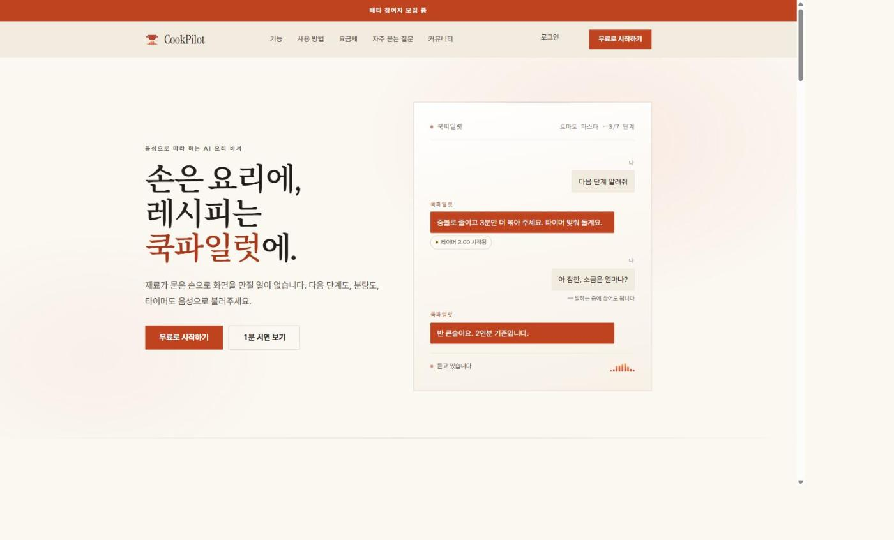
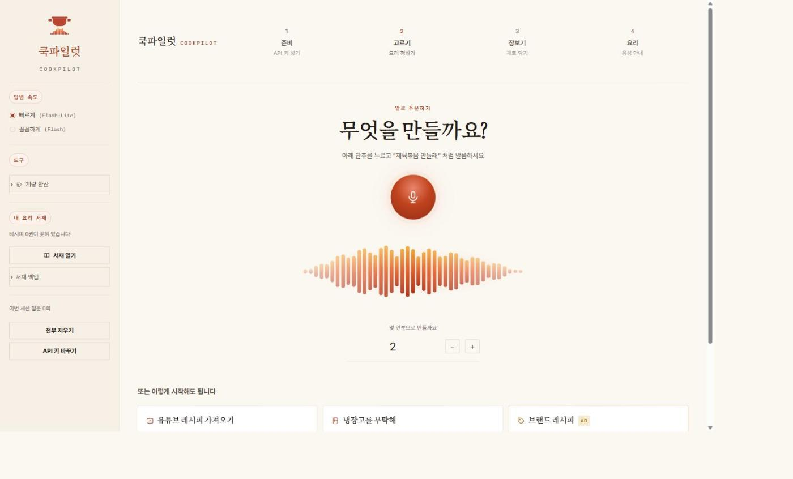
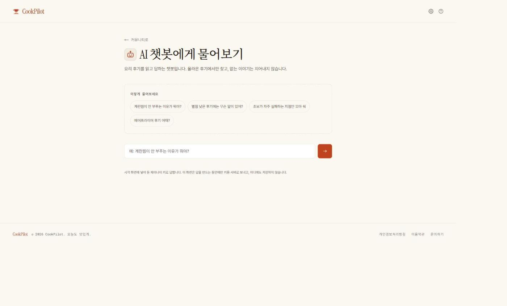
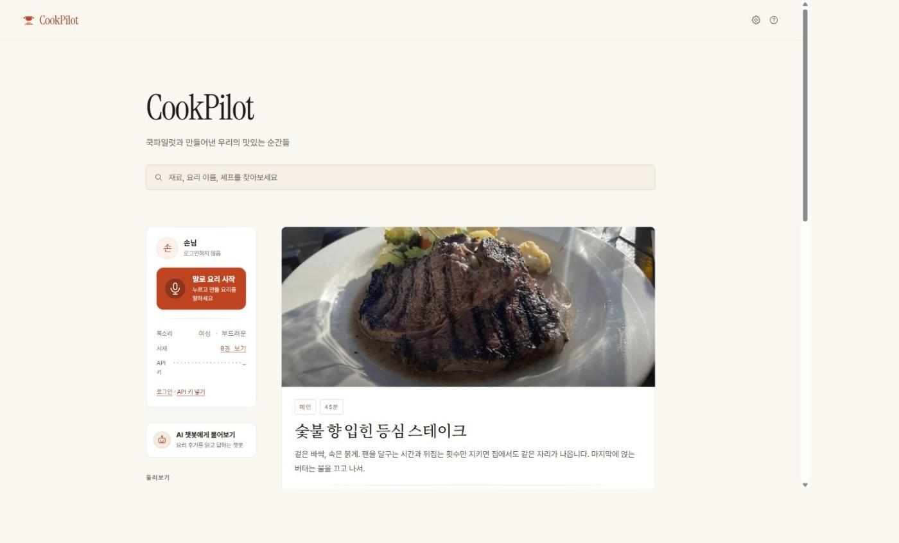

# 쿡파일럿 CookPilot

**손은 요리에, 레시피는 쿡파일럿에** — 말로 따라 하는 AI 요리 비서.

재료가 묻은 손으로 화면을 만질 일이 없습니다. 다음 단계도, 분량도, 타이머도
음성으로 부릅니다.

> **배포 주소**: <https://cookpilot-eight.vercel.app>



---

## 처음 열어 보신다면

이 세 가지만 알면 바로 둘러보실 수 있습니다.

1. **키 없이도 전 화면이 열립니다.** 로그인도 필요 없습니다. AI 기능만
   안내문과 함께 꺼져 있고 나머지는 그대로 돕니다.
2. **AI 기능을 켜려면 `/start` 에서 본인 제미나이 키를 넣습니다.** 이 서비스는
   키를 서버에 두지 않습니다. 방문자의 브라우저(`localStorage`)에만 담기고,
   거기서 구글로 바로 나갑니다 (`lib/adapter/browser-api-key-store.ts`).
   키는 [Google AI Studio](https://aistudio.google.com/apikey) 에서 무료로 받습니다.
3. **가입에는 확인 메일이 옵니다.** 실제로 받을 수 있는 주소를 쓰셔야 합니다.
   로그인 없이도 커뮤니티 글을 읽는 데는 지장이 없습니다.

---

## 무엇을 하는 앱인가

기능 명세는 `docs/flow/flow.md` 에 FN01–FN13 으로 정리돼 있습니다. 크게 다섯 덩어리입니다.

| 무엇 | 화면 | 명세 |
|---|---|---|
| **레시피 만들기** — 말로 주문 · 유튜브 링크 · 냉장고 재료, 세 갈래 | `/pick` → `/shop` | FN03 · FN04 · FN05 |
| **음성으로 요리 진행** — 이 프로젝트의 핵심 | `/cook` | FN06 |
| **AI 요리 상담** — 후기를 근거로 답하는 RAG | `/ask` | FN11 |
| **커뮤니티** — 글 · 댓글 · 좋아요 · 프로필 | `/community` `/posts/[id]` | FN07~FN10 · FN13 |
| **레시피 서재** — 만든 레시피 보관 | `/shelf` | FN12 |

요리 화면(`/cook`)은 **말하는 중에 끊어도 됩니다.** Gemini Live API 를 WebSocket 으로
붙이고, 마이크 입력은 AudioWorklet 으로 별도 오디오 스레드에서 처리합니다
(`public/audio/pcm-worklet.js`, `lib/adapter/gemini-live-gateway.ts`).

## 화면

| 요리 정하기 `/pick` | AI 상담 `/ask` |
|---|---|
|  |  |

말로 주문하거나, 유튜브 링크를 던지거나, 냉장고에 있는 것을 부르면 됩니다.
상담은 올라온 후기에서만 찾고 없는 이야기는 지어내지 않습니다.



## 기술 스택

| 갈래 | 쓴 것 |
|---|---|
| 프레임워크 | **Next.js 16** (App Router · Turbopack) · **React 19** · **TypeScript** (`strict`) |
| 스타일 | **Tailwind v4** + `app/globals.css` 한 파일에 모은 디자인 시스템 |
| 인증 · DB · 저장소 | **Supabase** (Auth · Postgres · Storage · RLS) |
| AI — 요리 | **Google Gemini** — REST(레시피 생성) + **Live API WebSocket**(음성 대화) |
| AI — 상담 | **Pinecone** 벡터 검색 + **LangChain** 체인 (RAG) |
| 오디오 | **AudioWorklet** — 마이크 PCM 변환을 오디오 스레드에서 |
| 배포 | **Vercel** (Edge Middleware 로 세션 갱신) |

글꼴은 `next/font` 로 셀프호스팅합니다 — 제목은 Instrument Serif(라틴)와
Noto Serif KR(한글), 숫자는 Roboto Mono. 본문 Pretendard 만 구글 글꼴에 없어
CDN 에서 받아 옵니다.

## 아키텍처

클린 아키텍처를 지켰습니다. **의존 방향은 항상 안쪽으로만** 흐릅니다.

```
   바깥                                                     안쪽
┌──────────────┐  ┌──────────────┐  ┌───────────┐  ┌────────────┐
│  app/        │→ │ lib/adapter/ │→ │lib/usecase│→ │ lib/domain │
│  components/ │  │              │  │           │  │            │
│  proxy.ts    │  │  23개 파일   │  │  12개     │  │   17개     │
└──────────────┘  └──────────────┘  └───────────┘  └────────────┘
  화면·라우트       Supabase·Gemini    흐름 조립      규칙·엔티티
                    Pinecone·브라우저
```

- `lib/domain/` 은 유스케이스를 모릅니다. `lib/usecase/` 는 React·Next.js·DB·`fetch`
  를 모릅니다. 바깥 계층이 안쪽을 가져다 씁니다.
- 유스케이스가 저장소나 외부 API 를 쓸 때는 그 계층에 **인터페이스를 두고 구현을
  주입**합니다. 구현체는 전부 `lib/adapter/` 에 있습니다.
- React 컴포넌트와 라우트 핸들러는 얇습니다. 입력을 받아 유스케이스를 부르고
  결과를 그리는 일만 합니다.

자세한 것은 **`ARCHITECTURE.md`** 를 봅니다.

### 화면과 API

- 페이지 17개 (`app/**/page.tsx`), 서버 액션 4개 (`app/actions/`)
- API 라우트 3개
  - `POST /api/chat` — 브라우저가 보낸 키로 RAG 체인을 서버에서 돌린다
  - `GET /api/chat/[id]` — 저장된 상담 대화를 읽는다
  - `POST · GET /api/kitchen/index` — 후기 CSV 를 파인콘에 색인한다
- **`proxy.ts`** — Next.js 16 에서 `middleware.ts` 의 새 이름입니다. 요청마다
  세션 쿠키를 갱신합니다. 렌더 도중에는 쿠키를 심을 수 없어 갱신할 자리가
  여기뿐입니다. 없으면 한 시간쯤 뒤에 갑자기 로그아웃됩니다.

## 직접 돌려 보기

Node **20.9 이상**이 필요합니다.

```bash
git clone https://github.com/Van-Sihan/CookPilot-Public-.git
cd CookPilot-Public-
npm install
cp .env.example .env.local     # 값을 채운다 (아래 표)
npm run dev
```

http://localhost:3000 을 엽니다. **환경 변수가 하나도 없어도 소개 화면과 `/start`
는 그대로 뜹니다.**

### Supabase — 로그인·커뮤니티를 쓰려면

`supabase/migrations/` 의 SQL 5개를 **파일 이름 순서대로** SQL Editor 에 한 번씩
실행합니다. 표·RLS 정책·트리거에 더해 스토리지 버킷(`post-covers`, `avatars`)까지
이 SQL 이 만듭니다. 예시 데이터가 필요하면 `supabase/seed.sql` 도 실행합니다.

> 다시 실행해도 안전한 SQL 이 아닙니다. 한 번씩만 돌립니다.

`Authentication → Sign In / Providers` 에서 `Confirm Email` 을 **꺼 두면** 가입
테스트가 편합니다.

### Pinecone — `/ask` 상담을 쓰려면

**인덱스는 코드가 만들지 않습니다. 콘솔에서 직접 만들어야 하고, 규격이 맞아야
합니다.**

| 항목 | 값 |
|---|---|
| 종류 | Serverless |
| 임베딩 | **통합 임베딩(integrated embedding)** — 모델 `llama-text-embed-v2` |
| 차원 | **1024** |
| 네임스페이스 | `reviews` — 코드가 정하므로 콘솔에서 만들 필요 없음 |

근거는 `lib/adapter/langchain-rag.ts:45,47,53` 입니다. 다른 모델이나 차원으로
만들면 색인이 실패합니다.

인덱스를 만든 뒤 **후기 색인을 한 번 돌려야** 합니다.

```bash
curl -X POST http://localhost:3000/api/kitchen/index
```

`samples/reviews.csv` 의 후기 101건이 올라갑니다. 같은 id 를 덮어쓰므로 여러 번
돌려도 안전합니다. **이걸 안 돌리면 `/ask` 가 늘 "관련 후기를 찾지 못했습니다"
라고만 답합니다.** 잘 올라갔는지는 이렇게 봅니다.

```bash
curl "http://localhost:3000/api/kitchen/index?q=김치찌개"
```

### 제미나이 키

**`.env.local` 에 넣지 않습니다.** 방문자가 `/start` 화면에서 직접 넣고, 그 값은
브라우저에만 담깁니다. 기계를 바꾸면 다시 넣어야 합니다 — 옮길 파일이 아니라
다시 입력할 값입니다.

## 환경 변수

`.env.local` 은 깃에 올라가지 않습니다(`.gitignore` 의 `.env*`). 견본과 설명은
**`.env.example`** 에 있습니다.

| 변수 | 필요한 곳 | 없으면 | 어디서 |
|---|---|---|---|
| `NEXT_PUBLIC_SUPABASE_URL` | 필수 | 로그인·가입 서버 액션이 예외를 던진다. 그 외 화면은 우아하게 비활성 | 수파베이스 **[Connect]** |
| `NEXT_PUBLIC_SUPABASE_PUBLISHABLE_KEY` | 필수 | 〃 (`ANON_KEY` 이름으로 나와도 호환) | 〃 |
| `PINECONE_API_KEY` | `/ask` | 상담이 `reason:"key"` 를 돌려준다. 앱은 안 죽는다 | 파인콘 콘솔 |
| `PINECONE_HOST` | `/ask` | 〃 | 파인콘 인덱스의 Host |
| `PINECONE_INDEX` | 선택 | 비면 `PINECONE_HOST` 에서 이름을 유도한다 | 〃 |
| `GOOGLE_API_KEY` | 선택 | 비면 브라우저가 보낸 키를 쓴다. 요리 기능은 원래 브라우저 키만 쓴다 | Google AI Studio |
| `NEXT_PUBLIC_SITE_URL` | 선택 | 링크 미리보기 주소만 영향. 버셀이 운영 도메인을 자동으로 넣는다 | — |

## 직접 배포하기 (Vercel)

1. Vercel → **Add New… → Project** → 이 저장소 **Import**
2. **Environment Variables** — ⚠️ **`.env.example` 때문에 버셀이 미리 만들어 둔
   빈 값 줄을 반드시 지웁니다.** 안 지우면 값이 `""` 로 들어가 로그인이 깨집니다.
   값이 있는 4개만 넣습니다.
3. **Deploy**
4. Supabase → `Authentication → URL Configuration` 에 배포 주소를 넣습니다.
   `Site URL` 이 가입 확인 메일의 링크 주소가 됩니다.
5. 배포된 주소로 `POST /api/kitchen/index` 를 한 번 부릅니다.

절차와 그동안 밟은 점검 기록은 **`docs/deploy/vercel.md`** 에 있습니다.

## 폴더 구조

| 경로 | 내용 |
|---|---|
| `app/` | 라우트·페이지·API·서버 액션. `layout.tsx` 는 글꼴과 메타데이터 |
| `app/globals.css` | 디자인 시스템 전체 — 팔레트, 여백, 반응형 분기 |
| `components/` | 화면별 마크업. 글을 들고 있지 않고 `lib/` 에서 가져다 쓴다 |
| `lib/domain/` `lib/usecase/` `lib/adapter/` | 규칙 → 흐름 → 바깥세상 |
| `lib/site-content.ts` | 문구·요금·FAQ. **카피만 고칠 거면 이 파일만** |
| `proxy.ts` | 요청마다 세션 갱신. Next.js 16 의 `middleware.ts` |
| `supabase/` | 마이그레이션 SQL 5개 · 시드 · `config.toml` |
| `samples/reviews.csv` | RAG 색인용 후기 101건 |
| `public/` | 정적 파일. `audio/pcm-worklet.js` 가 AudioWorklet 프로세서 |
| `design/` | 원본 디자인 시안과 로고 |
| `docs/` | 문서 (아래) |

클래스 이름은 `design/index_dark_2.html` 시안과 같게 두었습니다. 시안에서 클래스를
찾아 `components/` 를 grep 하면 대응되는 위치가 바로 나옵니다.

## 문서

| 문서 | 내용 |
|---|---|
| `ARCHITECTURE.md` | 계층 구조와 파일별 설명 |
| `docs/flow/flow.md` | 기능별 실행 흐름 FN01–FN13 |
| `docs/flow/map.pdf` | 계층(L)·데이터(D)·화면 여정(J)·시스템(S) 배치도 |
| `docs/flow/phases.pdf` | 사용자 흐름 · 기능/데이터 구조 · 인증/오류 |
| `docs/spec/CookPilot_기능명세서_HIPO.xlsx` | 기능명세서 · 기능체크리스트 · HIPO |
| `docs/usecase/` | 유스케이스 다이어그램 |
| `docs/deploy/vercel.md` | 배포 절차와 점검 기록 |
| `CHANGELOG.md` | 무엇이 언제 왜 바뀌었는지. 최신 항목이 위 |
| `ERRORS.md` | 막혔던 오류와 **왜 그것이 문제였는지** |

`docs/*/_build/` 의 파이썬 스크립트는 위 PDF·xlsx·다이어그램을 실제로 만들어 낸
코드입니다. 결과물만 있고 만든 과정이 없지 않도록 함께 두었습니다.

## 알려진 제약

정직하게 적어 둡니다.

| 제약 | 내용 |
|---|---|
| 예시 게시글 16편 | 표가 아니라 파일에 있다. 좋아요·즐겨찾기가 걸리지 않고 댓글은 브라우저에만 쌓인다 |
| 즐겨찾기 목록 화면 없음 | 표와 정책은 있지만 모아 보는 화면을 아직 안 만들었다 |
| 태그 1개 제한 | `posts.badge` 가 단일 칸이라 게시글당 태그 하나다 |
| `?next=` 미사용 | 로그인 후에는 원래 화면이 아니라 항상 `/start` 로 간다 |
| `/api/kitchen/index` 무인증 | 누구나 부를 수 있다. 예시 후기 CSV 를 다시 올리기만 하는 엔드포인트라 지금은 열어 두었다 |
| 자동화 테스트 없음 | 타입 검사(`strict`)와 수동 점검으로 갈음했다 |

자세한 것은 `docs/spec/CookPilot_기능명세서_HIPO.xlsx` 의 `02_기능체크리스트` 를 봅니다.

## 명령

```bash
npm run dev      # 개발 서버
npm run build    # 프로덕션 빌드 (타입 오류가 있으면 여기서 멈춘다)
npm run start    # 빌드 결과 실행
npm run lint     # ESLint
```

## 라이선스

코드는 **MIT** 입니다 — `LICENSE`.

`public/food/` 의 요리 사진은 **위키미디어 공용에서 가져온 별도 저작물**입니다.
CC BY · CC BY-SA · CC0 · Public domain 이 섞여 있고, 파일별 촬영자와 조건은
`public/food/CREDITS.md` 에 있습니다. CC BY 계열은 촬영자를 밝히는 것이 조건이라
글 화면에서 사진 바로 밑에 촬영자와 허락문 링크를 함께 보여 줍니다.
