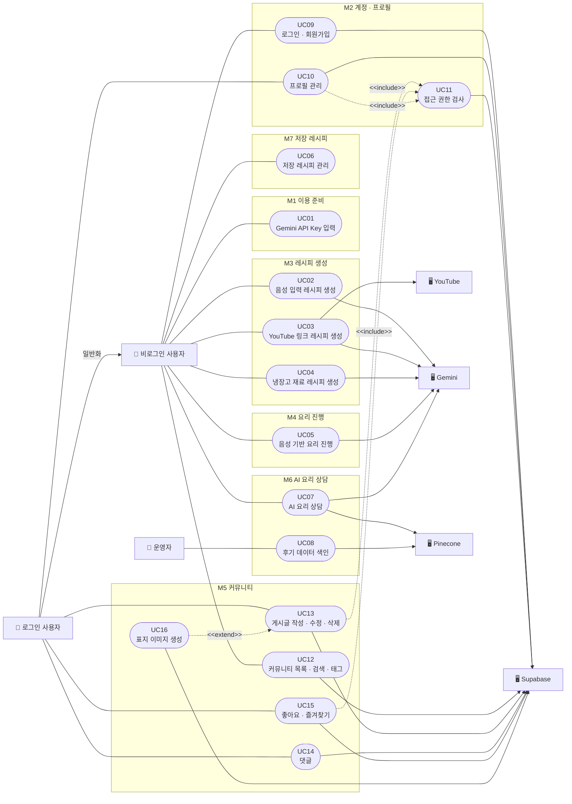

# CookPilot Use Case Diagram

사용자가 CookPilot 에서 무엇을 할 수 있고, 각 기능이 어떤 외부 시스템과
관계를 가지는지 보여준다. 함수명 · 파일 경로 · 테이블 이름은 넣지 않는다.
그 정보는 `docs/spec/CookPilot_기능명세서_HIPO.xlsx` 와
`docs/flow/flow.md` 가 갖고 있다.

| 산출물 | 파일 |
| --- | --- |
| 다이어그램 | `docs/usecase/CookPilot_UseCase_Diagram.svg` · `.png` |
| Mermaid | 이 문서의 아래 절 |
| 매핑표 | 이 문서의 아래 절 |

---

## 행위자

| ID | 행위자 | 근거 |
| --- | --- | --- |
| A1 | 비로그인 사용자 | `/pick` · `/shop` · `/cook` · `/shelf` · `/ask` · `/community` 에 접근 제한이 없다 |
| A2 | 로그인 사용자 | `app/write/page.tsx:F4` · `app/account/page.tsx:F3` · `app/posts/[id]/edit/page.tsx:F3` 이 인증을 요구한다 |
| A3 | 운영자 | `app/api/kitchen/index/route.ts:F1` — 사용자 화면이 없는 운영 작업 |
| E1 | YouTube | `lib/domain/recipe.ts:F30` 썸네일 · 영상 URL 을 모델에 전달 |
| E2 | Gemini | `lib/adapter/gemini-recipe-gateway.ts:F5` · `gemini-live-gateway.ts:F1` · `langchain-rag.ts:F29` |
| E3 | Pinecone | `lib/adapter/langchain-rag.ts:F28` · `F10` |
| E4 | Supabase | `lib/adapter/supabase-server-client.ts:F3` 외 |

**행위자가 아닌 것** — localStorage · Supabase 테이블 · 서버 액션 · 
라우트 핸들러 · React 컴포넌트는 구현 계층이라 넣지 않았다.
쇼핑몰 검색(D4-6)은 CookPilot 이 호출하지 않고 사용자가 새 창으로 여는
이동이라 행위자에서 뺐다. 브라우저 음성 합성(D4-7)은 내장 기능이라 뺐다.

### 일반화

`A2 로그인 사용자` ─▷ `A1 비로그인 사용자`

권한이 다르기 때문이 아니라, **A1 이 쓰는 유스케이스에 인증 검사가 하나도
없어서 A2 도 그대로 쓸 수 있음이 코드에서 확인**되기 때문이다.

---

## include · extend

| 관계 | 내용 | 근거 |
| --- | --- | --- |
| `UC13` `UC15` `UC10` → `UC11` `<<include>>` | 모든 실행 경로에서 접근 권한 검사를 거친다 | `app/write/page.tsx:F4` · `components/post/post-actions.tsx:F5` · `app/account/page.tsx:F3` |
| `UC16` → `UC13` `<<extend>>` | 표지 이미지는 선택이다. 없어도 게시글이 올라간다 | `components/write/write-form.tsx:F11` |

**`UC14 댓글` 에는 include 를 걸지 않았다.** 게시글 댓글은 인증을 거치지만
예시 게시글 댓글은 브라우저에만 저장되어 인증 없이 동작한다
(`components/post/post-talk.tsx:F5`). 모든 경로에서 수행되지 않으므로
`<<include>>` 조건에 맞지 않는다.

---

## Mermaid

---

## 매핑표

| Use Case ID | Use Case명 | Actor | 기능 ID | 모듈 ID | 외부 시스템 | 관련 화면 | 관련 데이터 | 근거 |
| --- | --- | --- | --- | --- | --- | --- | --- | --- |
| UC01 | Gemini API Key 입력 | 비로그인 사용자 | FN01 | M1 | 없음 | J1 | D1-1 | `components/start/api-key-form.tsx:F5 · lib/usecase/enter-with-api-key.ts:F1` |
| UC02 | 음성 입력 레시피 생성 | 비로그인 사용자 | FN03 | M3 | Gemini | J2 | D1-1 · D1-3 · D4-1 | `components/pick/voice-console.tsx:F6 · lib/usecase/plan-recipe.ts:F1` |
| UC03 | YouTube 링크 레시피 생성 | 비로그인 사용자 | FN04 | M3 | YouTube · Gemini | J2 | D1-3 · D4-1 · D4-5 | `lib/usecase/plan-recipe.ts:F8 · lib/domain/recipe.ts:F22` |
| UC04 | 냉장고 재료 레시피 생성 | 비로그인 사용자 | FN05 | M3 | Gemini | J2 | D1-3 · D4-1 | `lib/usecase/plan-recipe.ts:F12 · lib/usecase/plan-recipe.ts:F13` |
| UC05 | 음성 기반 요리 진행 | 비로그인 사용자 | FN06 | M4 | Gemini | J2 | D1-1 · D1-2 · D1-3 · D4-2 · D4-7 | `components/cook/live-console.tsx:F12 · lib/adapter/gemini-live-gateway.ts:F1` |
| UC06 | 저장 레시피 관리 | 비로그인 사용자 | FN12 | M7 | 없음 | J6 | D1-3 · D1-4 | `lib/usecase/keep-recipe-shelf.ts:F7 · components/shelf/shelf-stand.tsx:F6` |
| UC07 | AI 요리 상담 | 비로그인 사용자 | FN11 | M6 | Gemini · Pinecone | J5 | D1-6 · D2-6 · D2-7 · D4-3 · D4-4 | `components/ask/ask-shell.tsx:F8 · lib/usecase/ask-kitchen.ts:F1` |
| UC08 | 후기 데이터 색인 | 운영자 | FN11 | M6 | Pinecone | 확인 필요 (화면 없음) | D4-4 | `app/api/kitchen/index/route.ts:F1 · lib/adapter/langchain-rag.ts:F10` |
| UC09 | 로그인 · 회원가입 | 비로그인 사용자 | FN02 | M2 | Supabase | J1 | D2-1 | `app/actions/auth.ts:F2 · lib/usecase/sign-in.ts:F1` |
| UC10 | 프로필 관리 | 로그인 사용자 | FN10 | M2 | Supabase | J7 | D2-1 · D3-2 | `lib/usecase/rename-me.ts:F6 · lib/adapter/browser-avatar-upload.ts:F6` |
| UC11 | 접근 권한 검사 | — (관계로만 연결) | 해당 없음 (J7) | M2 | Supabase | J7 | D2-1 | `app/write/page.tsx:F4 · app/account/page.tsx:F3 · app/posts/[id]/edit/page.tsx:F3` |
| UC12 | 커뮤니티 목록 · 검색 · 태그 | 비로그인 사용자 | FN13 | M5 | Supabase | J3 | D2-1 · D2-2 · D3-1 | `app/community/page.tsx:F1 · lib/domain/community-tab.ts:F8` |
| UC13 | 게시글 작성 · 수정 · 삭제 | 로그인 사용자 | FN07 | M5 | Supabase | J4 · J7 | D2-2 · D3-1 | `app/actions/post.ts:F2 · lib/usecase/write-post.ts:F1` |
| UC14 | 댓글 | 로그인 사용자 | FN08 | M5 | Supabase | J3 · J7 | D2-5 · D1-5 | `app/actions/post.ts:F17 · lib/usecase/discuss-post.ts:F11` |
| UC15 | 좋아요 · 즐겨찾기 | 로그인 사용자 | FN09 | M5 | Supabase | J3 | D2-3 · D2-4 | `app/actions/post.ts:F25 · lib/usecase/react-to-post.ts:F2` |
| UC16 | 표지 이미지 생성 | — (관계로만 연결) | FN07 | M5 | Supabase | J4 | D3-1 | `components/write/write-form.tsx:F11 · lib/adapter/browser-cover-upload.ts:F3` |

---

## 확인 필요

| 항목 | 내용 |
| --- | --- |
| `UC08` 관련 화면 | 후기 데이터 색인은 사용자 화면이 없다. `POST /api/kitchen/index` 로만 실행한다 |
| `UC08` 접근 제한 | 이 라우트에 인증 검사가 없다. 누구나 호출할 수 있다 |
| 관리자 화면 | 코드에 없다. `A3 운영자` 는 화면이 아니라 라우트로만 상호작용한다 |

---

## 이름이 FN 과 다른 3건

기능 ID 는 그대로 두고 이름만 유스케이스에 맞게 줄이거나 나눴다.

| Use Case | 기능 | 왜 다른가 |
| --- | --- | --- |
| `UC07` AI 요리 상담 | `FN11` AI 요리 상담 (RAG) | RAG 는 구현 기술이라 유스케이스 이름에서 뺐다 |
| `UC08` 후기 데이터 색인 | `FN11` AI 요리 상담 (RAG) | 같은 기능이지만 행위자가 `A3 운영자` 로 다르고 사용자 화면이 없다 |
| `UC16` 표지 이미지 생성 | `FN07` 게시글 작성 · 수정 · 삭제 | 선택 단계라 `<<extend>>` 로 떼어 냈다 |

나머지 13건은 `docs/flow/flow.md` 의 기능명을 그대로 쓴다.
